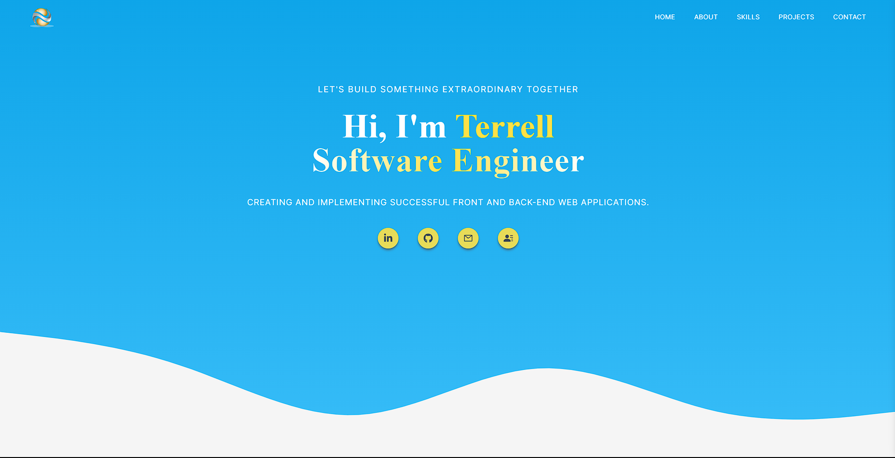

# My Portfolio

[My Portfolio](https://terrelljackson.vercel.app/) A place to view my latest projects.
This portfolio uses the following technologies:

- [Next JS](https://nextjs.org/): to create full-stack Web applications by extending the latest React features
- [Vercel](https://vercel.com/): site and server hosting
- [Tailwind](https://tailwindcss.com/): CSS Framework for the styles
- [React-Icons](https://www.npmjs.com/package/react-parallax-tilt): for tilting animation on logo
- [ToolTip](https://www.npmjs.com/package/particles-bg): For background animation

### Project Improvements: 
- Next.JS 13 update
- Functioning contact form
- Redesign
- Vercel hosting

### Challenges: 
Throughout the development of this project, I have meticulously crafted a website using advanced web technologies. The site showcases a seamless user experience with optimized page load speed and search engine optimization techniques.

By leveraging cutting-edge frameworks like Next.js and Tailwind CSS, I have ensured that the website remains highly performant and visually appealing. I have implemented server-side rendering to enhance search engine visibility, making it easy for search engines to index and rank the site's content effectively.
The user interface incorporates lazy-loading images, optimizing the page load speed and providing a smooth browsing experience. Effortless navigation is achieved through client-side routing, utilizing the latest features of Next.js to deliver a seamless journey for users.

To facilitate user engagement, a custom API has been developed within the Next.js framework. This API handles form submissions, allowing users to send messages directly through the website. The integration of Node Mailer ensures that emails from the integrated form are delivered seamlessly, fostering effective communication channels.

Throughout the project, I have demonstrated my skills as a resourceful software engineer, adapting to challenges and consistently delivering high-quality results. By staying updated with evolving technologies and overcoming obstacles, I have strengthened my problem-solving abilities and decision-making skills. This experience positions me to make valuable contributions to future projects that require meticulous attention to detail, innovative thinking, and robust research.

### Website Deployed

You can find the project website here: [Live Site](https://terrelljackson.vercel.app/)

---

    
<b>App Screenshot:<b>

    

